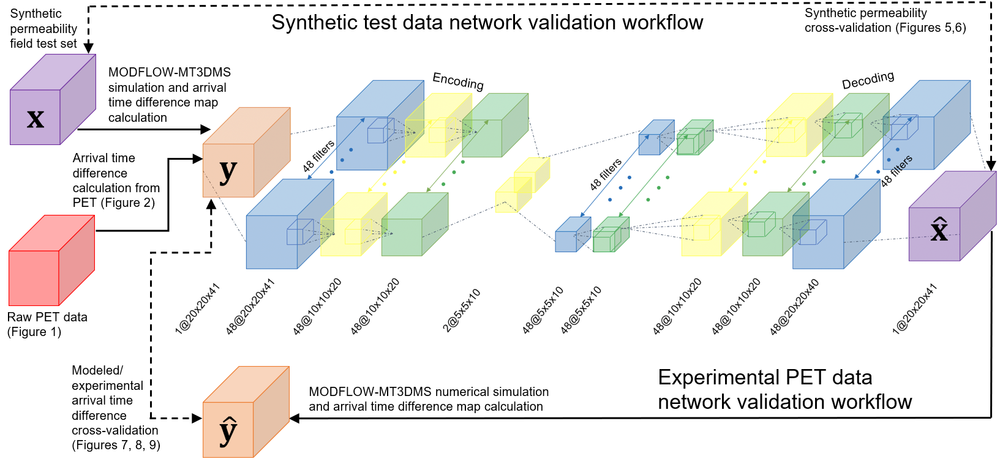

## Three-Dimensional Permeability Inversion Using Convolutional Neural Networks and Positron Emission Tomography

</img>

The first step in understanding how water and contaminants are flowing in the subsurface is to describe the ease at which fluid can flow—a hydrogeologic property termed permeability. Variation in permeability is an intrinsic property of geologic materials that arises due to differences in the underlying geologic processes that generated the materials. Recent utilization of in situ imaging, specifically positron emission tomography (PET), enables the measurement of three-dimensional (3-D) time-lapse radiotracer solute transport in geologic porous media. 

Leveraging the relationship between local permeability variation and solute advection behavior, an encoder-decoder based convolutional neural network (CNN) is implemented as a permeability inversion scheme using a single PET scan of a radiotracer pulse injection experiment as input. Compared to traditional mathematical modeling approaches, the trained deep learning model significantly reduces the computational cost while accurately predicting the 3-D permeability distributions in real geologic materials. Details related to this work can be found in <a href="https://doi.org/10.1029/2021WR031554">here</a>.

### Workflow
The following is the schematic illustration of the inversion-validation workflow using both synthetic (top loop) and experimental PET data (bottom loop). The purple blocks correspond to synthetic/predicted permeability maps, the red block is the PET data, the orange blocks are experimental and modeled arrival time difference maps. The CNN components include convolutional blocks (blue), up/down-sampling block (yellow), and residual-in-residual dense blocks (green).

The network training was a supervised process. The inputs were 3-D image tensors containing the arrival time difference maps ($\pmb{y}$) and the permeability maps of the corresponding synthetic geologic core were the target data ($\pmb{x}$). The predicted permeability maps ($\pmb{\hat{x}}$) were compared with the target synthetic permeability maps ( $\pmb{x}$) through loss functions. Training accuracy was evaluated on the test set by individually comparing each synthetic permeability map with the network predicted permeability map or by comparing the experimental arrival time difference maps ($\pmb{y}$) and the modeled arrival time difference maps ($\pmb{\hat{y}}$) based on the network permeability map prediction.

</img>

